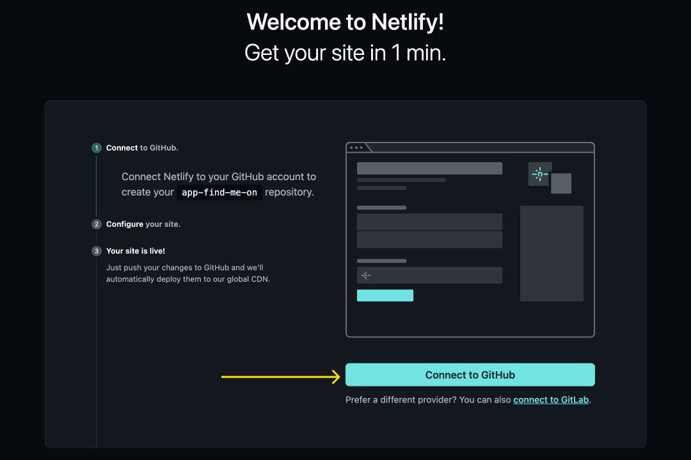
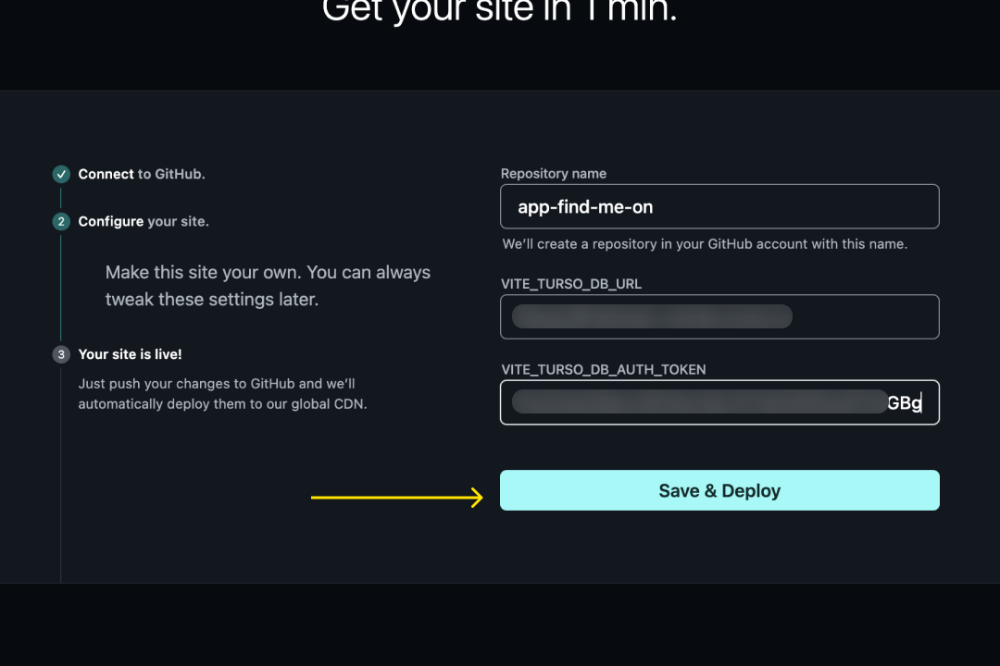
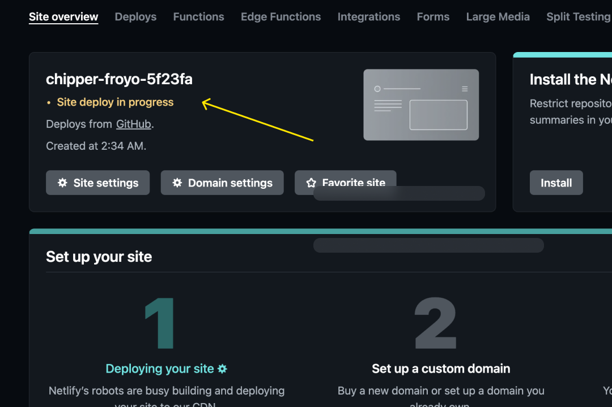
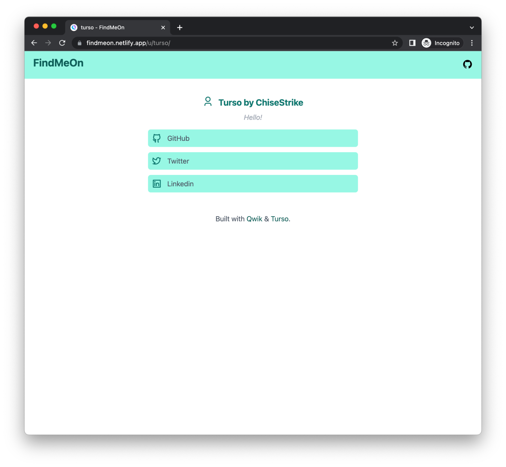
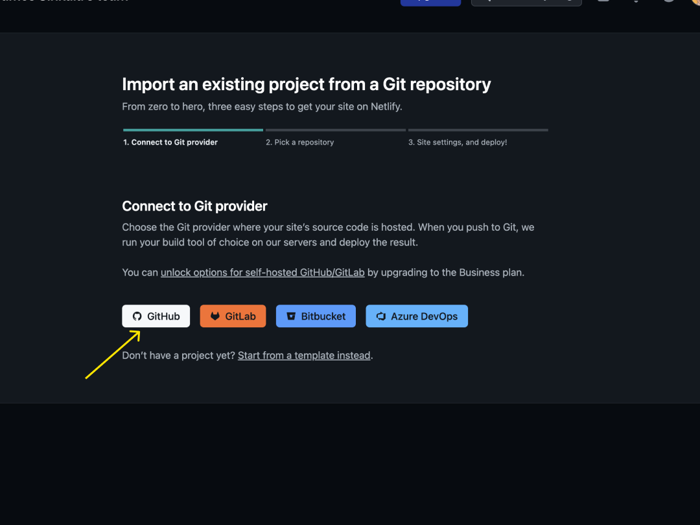
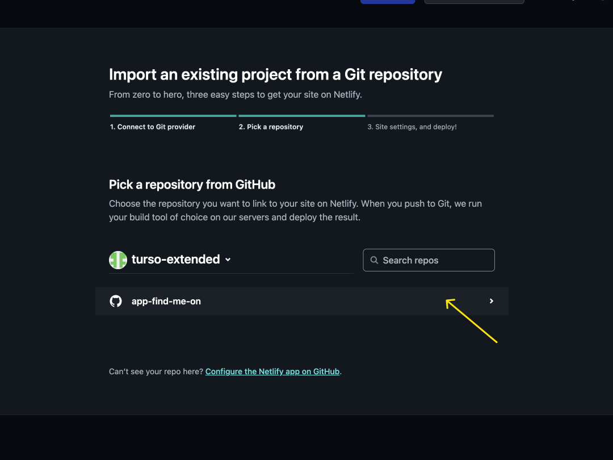
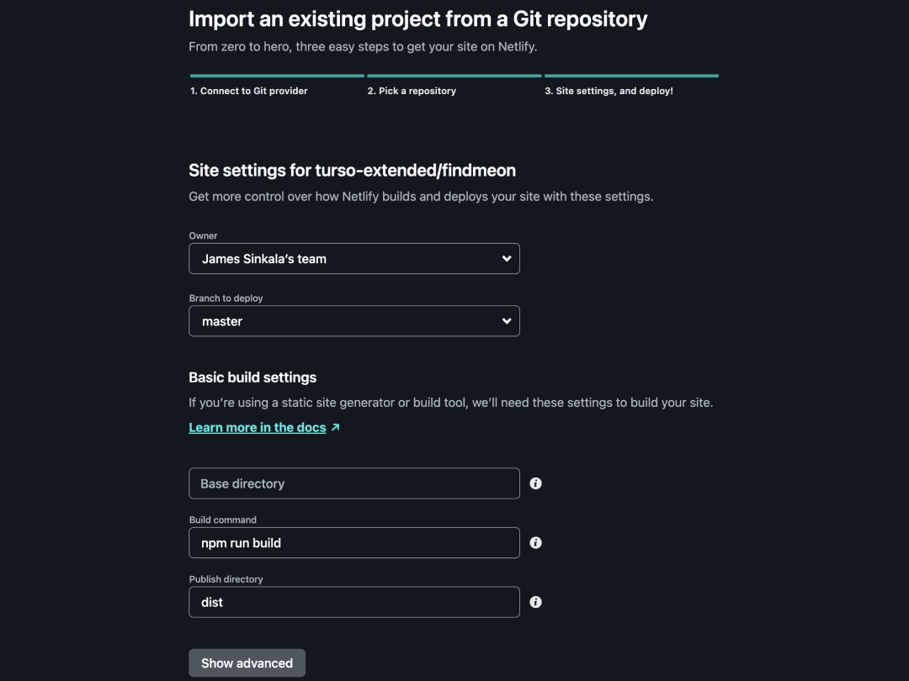
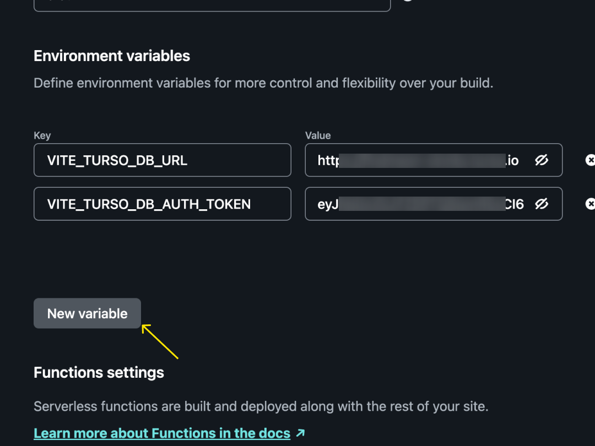
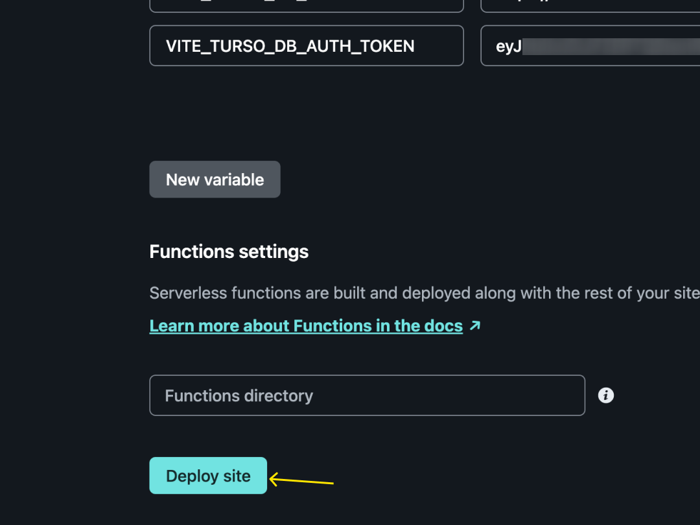

# Netlify setup guide

In this setup guide, you will deploy a web application that uses [Turso] as its
database. The deployment is configured with environment variables whose values
are obtained from the [Turso CLI].

You can find the [source code for the app on GitHub].

## Prerequisites

- A [Netlify account]
- The Turso CLI installed on your machine ([installation instructions])

## 1. Set up the Turso database

### 1a. Create a new database

Run the following CLI command:

```bash
$ turso db create findmeon
```

### 1b. Access the database using the shell

Run the following CLI command:

```bash
$ turso db shell findmeon
```

### 1c. Define and populate the database

Copy and paste the following SQL statements into the shell to create tables,
indexes, and sample data:

```sql
-- users table
create table users(
    id integer primary key,
    email varchar(255) not null,
    full_name varchar(100) not null,
    username varchar(50) not null,
    created_at integer default (cast(iunixepoch() as int))
);

-- links table
create table links(
    id integer primary key,
    user_id integer not null,
    website varchar(100) not null,
    link text not null,
    created_at integer default (cast(iunixepoch() as int)),

    foreign key(user_id) references users(id)
);

-- unique index for the email row
create unique index idx_users_email on users(email);

-- unique index for the username row
create unique index idx_users_username on users(username);

-- a multicolumn index for the user_id and link columns
create unique index idx_links_userid_link on links(user_id, link);

-- create user: "turso"
insert into users(id, email, full_name, username) values(1, "no-reply@chiselstrike.com", "Turso by ChiseStrike", "turso");

-- add some links to "turso"
insert into links(user_id, website, link) values(1, "Twitter", "https://twitter.com/ChiselStrike"),
(1, "Linkedin", "https://www.linkedin.com/company/chiselstrike"),
(1, "GitHub", "https://github.com/chiselstrike/chiselstrike");
```

### 1d. Quit the shell

Type the following at the shell prompt to terminate the shell:

```
.quit
```

## 2. Deploy the app to Netlify

### 2a. Start a guided installation

Click this button to start a guided deployment. It will automatically copy the
[app's source code] into your personal GitHub and deploy it from there.

[](https://app.netlify.com/start/deploy?repository=https://github.com/turso-extended/app-find-me-on)

:::note

If you would prefer to fork and deploy the source repo and configure the
deployment manually, follow the [manual installation instructions] at the end of
this page. The following instructions assume that you're using the above button
to perform the deployment.

:::

### 2b. Connect your Netlify account to your GitHub account

Netlify will prompt you to log in with your GitHub account:



### 2c. Provide values for the project's environment variables

The app (FindMeOn) requires two environment variables to enable it to connect to
the database you created earlier: `VITE_TURSO_DB_URL` and
`VITE_TURSO_DB_AUTH_TOKEN`. These values are required by the [libSQL TypeScript
client SDK] to initialize the client and connect to the Turso database.

Netlify prompts you for those values on the page you see after logging in.

#### Get the value for `VITE_TURSO_DB_URL`

Run the following CLI command:

```bash
$ turso db show findmeon --url
```

It outputs the URL for the database.  Copy that string into the
`VITE_TURSO_DB_URL` variable.

#### Get the value for `VITE_TURSO_DB_AUTH_TOKEN`

Run the following CLI command:

```bash
$ turso db tokens create findmeon -e none
```

This creates a long-lived authentication token that allows the libSQL client
library used by the app to connect to the database.  The `-e` flag in this
command is short for `--expiration`.

Copy the string into the `VITE_TURSO_DB_AUTH_TOKEN` variable.

#### Deploy the app

Click the "Save & Deploy" button to finalize the project’s deployment.



This will take you to the "Site overview" page on your Netlify dashboard which
displays the deployment status of the project. Once deployment is complete, you
can verify that the app works.



## 3. Verify the app works

In step 1, you created and populated the database with some sample data. You can
use the deployed app to view the sample data to verify that it's correctly
connected to Turso.

Using the deployment URL provided by Netlify, visit the path `/u/turso` under
it. This page displays the user data from the `users` and `links` tables.



## (Alternative) manual installation {#manual-installation}

If you want to deploy an app without the help of the "Deploy to Netlify" button
in step 2, you can instead use the Netlify dashboard to manually specify your
GitHub repo and configure its environment variables. The steps below walk you
through this process using the same source repository.

### 1. Fork the repo

Visit the [project on GitHub] and fork the repository to your own personal
account.

### 2. Import the project in the Netlify dashboard

Open your Netlify dashboard, add a new site, and import the existing project
that you just forked.


### 3. Connect to a Git provider

Choose GitHub from the list (if you forked the repo in step 1).



### 4. Pick your project’s repository

Netlify provides a list of repositories in your account. Choose your fork from
the list.



### 5. Configure site settings

Configure the site settings for your project, including the production branch,
build command, publish and base directory. (For most frameworks, Netlify
automatically detects and sets this configuration.)



### 6. Configure the app's environment variables

The app (FindMeOn) requires two environment variables to enable it to connect to
the database you created earlier: `VITE_TURSO_DB_URL` and
`VITE_TURSO_DB_AUTH_TOKEN`. These values are required by the [libSQL TypeScript
client SDK] to initialize the client and connect to the Turso database.

Click the "Show advanced" button on the site setting page.

#### 6a. Create an environment variable for `VITE_TURSO_DB_URL`

Use the "New variable" button to create a new environment variable called
`VITE_TURSO_DB_URL`.



Run the following CLI command:

```bash
$ turso db show findmeon --url
```

It outputs the URL for the database.  Copy that string into the
`VITE_TURSO_DB_URL` variable.

#### 6b. Create an environment variable for `VITE_TURSO_DB_AUTH_TOKEN`

Use the "New variable" button to create a new environment variable called
`VITE_TURSO_DB_AUTH_TOKEN`.

Run the following CLI command:

```bash
$ turso db tokens create findmeon -e none
```

This creates a long-lived authentication token that allows the libSQL client
library used by the app to connect to the database.  The `-e` flag in this
command is short for `--expiration`.

Copy the string into the `VITE_TURSO_DB_AUTH_TOKEN` variable.

### 7. Deploy the site



### 8. Preview the site after deployment


[Turso]: https://turso.tech
[Turso CLI]: /reference/turso-cli
[Netlify account]: https://app.netlify.com/signup
[installation instructions]: /reference/turso-cli#installation
[libSQL TypeScript client SDK]: /reference/client-access/javascript-typescript-sdk
[manual installation instructions]: #manual-installation
[source code for the app on GitHub]: https://github.com/turso-extended/app-find-me-on
[app's source code]: https://github.com/turso-extended/app-find-me-on
[project on GitHub]: https://github.com/turso-extended/app-find-me-on
